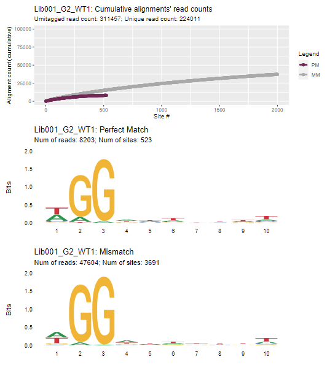
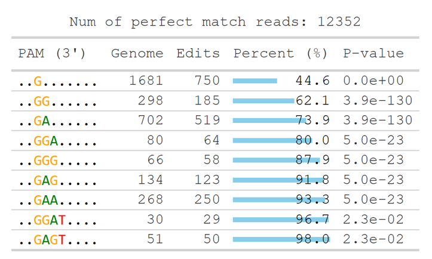
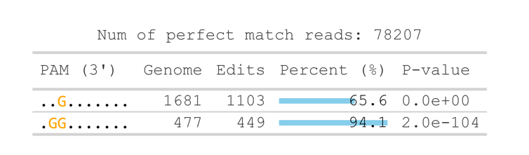

# GenomePAM


**GenomePAM** is a pipeline for identifying PAM (Protospacer Adjacent Motif) sequences from GUIDE-seq-style NGS data in the human genome (hg38). It takes demultiplexed paired-end FASTQ files as input, performs read trimming, UMI tagging and consolidation, aligns reads to the reference genome with BWA, identifies and annotates off-target sites, and produces comprehensive reports including PAM sequence logos and visualization of off-target sites.

## Table of Contents

- [GenomePAM](#genomepam)
  - [Table of Contents](#table-of-contents)
  - [Pipeline Overview](#pipeline-overview)
  - [Requirements](#requirements)
  - [Installation](#installation)
    - [1. Clone the repository](#1-clone-the-repository)
    - [2. Create the conda environment](#2-create-the-conda-environment)
    - [3. Download and index the reference genome](#3-download-and-index-the-reference-genome)
  - [Configuration](#configuration)
    - [`nextflow.config`](#nextflowconfig)
    - [`parameters.yml`](#parametersyml)
  - [Test Run](#test-run)
  - [Usage](#usage)
    - [Inputs](#inputs)
    - [AssaySpec details](#assayspec-details)
    - [Outputs](#outputs)
    - [Command](#command)
  - [Resource Configuration](#resource-configuration)
  - [License](#license)

## Pipeline Overview

The pipeline performs the following steps:

1. **Quality control** of raw sequencing reads (FastQC + MultiQC)
2. **Trimming and UMI tagging** of reads (adapter trimming, UMI extraction)
3. **Consolidation** of PCR duplicate reads
4. **Quality control** of trimmed and consolidated reads (FastQC + MultiQC)
5. **Alignment** to the reference genome (BWA) and **off-target identification**
6. **Annotation** of off-target sites (hg38 only)
7. **Visualization** of off-target sites and PAM sequence logos, plus the GenomePAM report

## Requirements

- [Conda](https://docs.conda.io/en/latest/) (or [Miniconda](https://docs.conda.io/en/latest/miniconda.html))
- Internet access for downloading the reference genome and conda packages

## Installation

### 1. Clone the repository

Check whether the `genomePAM` repository already exists in your working directory. If not, create and clone it (including submodules):

```shell
git clone --recurse-submodules git@github.com:Zheng-NGS-Lab/genomePAM.git
```

If the repository has already been cloned, download/update the submodules (e.g., the [UMI](https://github.com/aryeelab/umi) preprocessing library used by the GUIDE-seq module) with:

```shell
git submodule update --init --recursive
```

### 2. Create the conda environment

Create the `genomePAM` conda environment from the provided environment file:

```shell
conda env create -f environment.yml
```

### 3. Download and index the reference genome

Download the GRCh38 (hg38) reference genome and build the BWA index:

```shell
conda activate genomePAM
mkdir -p ~/reference
wget -c -O ~/reference/hg38.fna.gz https://ftp.ncbi.nlm.nih.gov/genomes/all/GCA/000/001/405/GCA_000001405.15_GRCh38/seqs_for_alignment_pipelines.ucsc_ids/GCA_000001405.15_GRCh38_no_alt_analysis_set.fna.gz
gunzip ~/reference/hg38.fna.gz
bwa index ~/reference/hg38.fna
```

## Configuration

### `nextflow.config`

Edit `nextflow.config` to point `genomePAM` to your local conda environment and `hg38` to your BWA-indexed reference genome:

```
params {
    // Path to conda env
    genomePAM = "/path/to/env/genomePAM"

    // Reference genome (bwa indexed)
    hg38 = "/path/to/bwa_indexed/hg38.fna"
}
```


### `parameters.yml`

All assay-specific parameters (input/output paths, reads layout, target specification) are defined in the [`parameters.yml`](parameters.yml) file. See [Inputs](#inputs) below for a full description of each parameter.

## Test Run

A minimal test dataset is bundled in the [`example/`](example) directory: two paired-end FASTQ files (`sample_R1.fastq.gz` and `sample_R2.fastq.gz`) together with a ready-to-use parameter file [`test.parameters.yml`](example/test.parameters.yml). After completing the [Installation](#installation) and [Configuration(nextflow.config)](#nextflowconfig) steps, verify the installation with:

```shell
cd genomePAM
conda activate genomePAM
nextflow run main.nf -params-file ./example/test.parameters.yml -with-report test.html
```

On success, results are written to `./results` and the run report to `test.html`.

## Usage

### Inputs

Paths to input directories and the corresponding parameters must be specified in a `parameters.yml` file:

| Parameter    | Default value                | Description                                                                                       |
|--------------|------------------------------|---------------------------------------------------------------------------------------------------|
| `FQDIR`      | — (required)                 | Path to the input directory containing demultiplexed paired-end FASTQ files                        |
| `OUTDIR`     | — (required)                 | Path to the output directory                                                                      |
| `BWATHREADS` | `4`                          | Number of threads used in the BWA alignment step                                                   |
| `Read1Tail`  | `AGATCGGAAGAGCACACGTC`       | Custom adapter sequence trimmed from the tail of read 1                                            |
| `Read2Tail`  | `AGATCGGAAGAGCGTCGTGT`       | Custom adapter sequence trimmed from the tail of read 2                                            |
| `pos1`       | `11`                         | 1-based start position of the FIXSEQ in read 1 (equals UMI length + 1)                             |
| `pos2`       | `18`                         | End position of the UMI + FIXSEQ region in read 1 (equals UMI length + FIXSEQ length)              |
| `posR2`      | `8`                          | Length of the FIXSEQ                                                                              |
| `xNs`        | `NNNNNNNNNN`                 | Placeholder string of Ns (e.g., `NNNNNNNNNN`), used to fill reads with a missing UMI or barcode; its length should match the UMI length (`pos1` − 1) |
| `FIXSEQ`     | `AGTGACAC`                   | Part of the adaptor sequence. ([details](https://github.com/Zheng-NGS-Lab/genomePAM/issues/2#issuecomment-4934451492)) |
| `GENOME`     | `hg38`                       | Reference genome identifier. Use `hg38` to enable annotation and the GenomePAM report; other genomes run the visualization branch only |
| `AssaySpec`  | — (required)                 | Target (spacer) sequence and PAM length denoted by the number of Ns, separated by an underscore    |

Default values are the ones shipped in the provided [`parameters.yml`](parameters.yml). Note that the pipeline validates that every parameter has a value — `FQDIR`, `OUTDIR`, and `AssaySpec` must always be filled in by the user before running.

### AssaySpec details

For PAM values occurring on the **3' end** of the spacer (e.g., Rep-1), the `AssaySpec` should be set such that (1) a `_` separates the spacer and the PAM, and (2) the length of the Ns equals the length of the candidate PAM:

```
GTGAGCCACTGTGCCTGGCC_NNNNNNNNNN
```

For PAM values occurring on the **5' end** of the spacer (e.g., Rep-1RC as the spacer; 10-nt-long PAM), the `AssaySpec` should be set as follows:

```
NNNNNNNNNNN_GGCCAGGCACAGTGGCTCAC
```

### Outputs

> **Note:** The images below are for illustration only — they are not the actual results of the [Test Run](#test-run).

1. BWA alignment files in BAM format
2. Tables of identified off-target sites (raw and annotated)
3. Visualization of identified off-target sites and the PAM sequence logo

    

4. MultiQC reports of raw FASTQ and trimmed + consolidated FASTQ
5. GenomePAM report
    - SaCas9

        

    - SpCas9

        

### Command

Activate the conda environment and run the pipeline:

```shell
cd genomePAM
conda activate genomePAM
nextflow run main.nf -params-file parameters.yml -with-report run_report.html
```

## Resource Configuration

The pipeline auto-detects available CPUs and memory for the local executor (reserving 2 cores and 8 GB for the system). You can override these limits on the command line:

```shell
nextflow run main.nf -params-file parameters.yml --max_cpus 8 --max_memory 64GB
```

Note: `BWATHREADS` must not exceed the executor CPU limit, otherwise the pipeline exits with an error.

## License

This project is licensed under the MIT License — see the [LICENSE](LICENSE) file for details.
